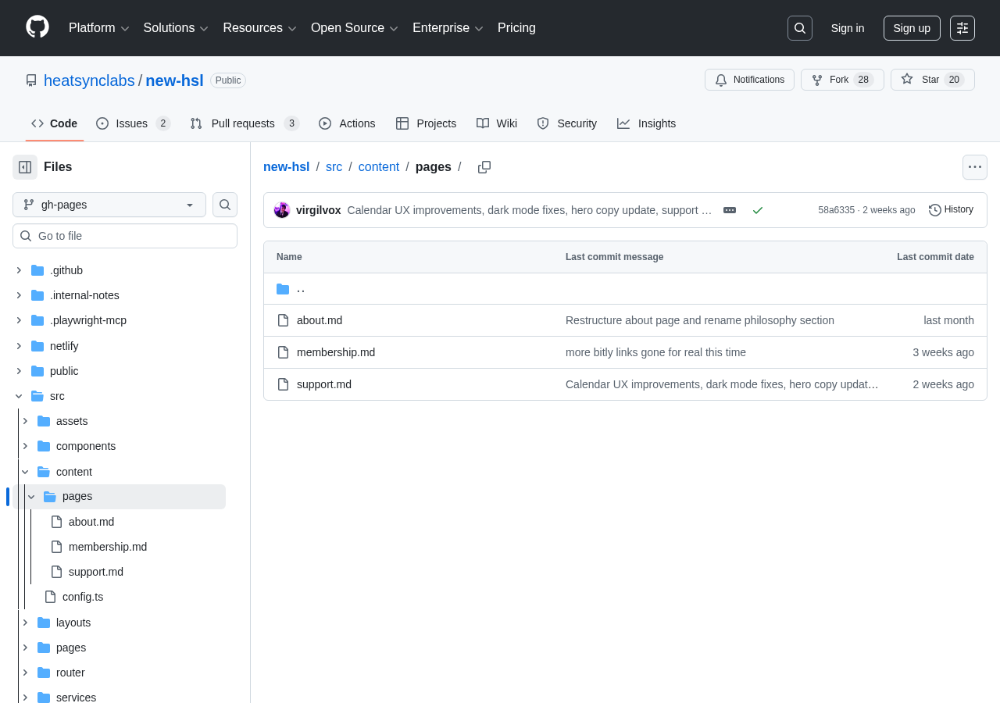
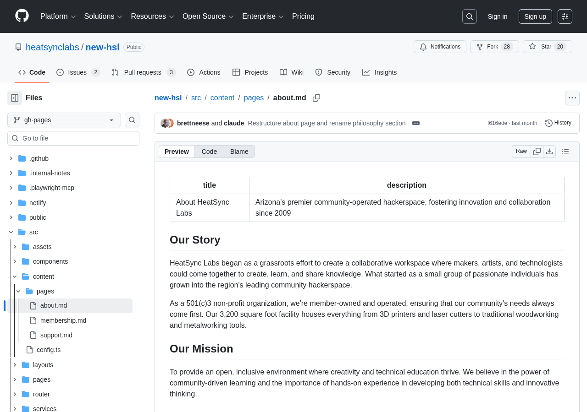

# Contributing to the HeatSync Labs Website

Thanks for helping improve the HeatSync Labs website! Whether you're fixing a typo or building new features, there's a path for you.

---

## 📝 Editing Content (No Coding Required)

This section is for **anyone** — you don't need to be a programmer. If you can type an email, you can edit this website.

### What You'll Need

- A **GitHub account** (free) — [Create one here](https://github.com/signup) if you don't have one
- That's it. No software to install.

### What You Can Edit

The website content lives in simple text files called **Markdown** (`.md`). You'll find them in:

```
src/content/pages/
├── about.md        ← About HeatSync Labs
├── membership.md   ← Membership info
└── support.md      ← How to support HSL
```

These files are plain text with some light formatting. Here's what they look like:

```markdown
---
title: "Page Title"
description: "A short description of the page"
---

## A Heading

Regular text goes here. You can make things **bold** or *italic*.

- Bullet points work like this
- Just start a line with a dash

[This is a link](https://example.com)
```

### How to Edit a Page (Step by Step)

#### Step 1: Find the file

Go to the content folder on GitHub:
👉 **[src/content/pages/](https://github.com/heatsynclabs/new-hsl/tree/gh-pages/src/content/pages)**

Click the file you want to edit (e.g., `about.md`).



#### Step 2: Click the pencil icon ✏️

On the file page, look for the **pencil icon** (✏️) near the top-right of the file content. Click it.

> **First time?** GitHub will say it needs to "fork" the repository. That's normal! Click the button to continue. A fork is just your own copy where you can make changes safely.



#### Step 3: Make your changes

You'll see a text editor with the file contents. Edit whatever you need — fix a typo, update info, add a section, update links.

> **Tip:** Click the **"Preview"** tab above the editor to see how your changes will look before saving. This shows your formatted text with headings, bold, links, etc.

#### Step 4: Propose your changes

When you're done editing:

1. Scroll down to the **"Propose changes"** section
2. Write a short summary of what you changed (e.g., "Updated open hours" or "Fixed typo in about page")
3. Click the green **"Propose changes"** button

#### Step 5: Create a Pull Request

GitHub will show you a comparison of your changes. Click the green **"Create pull request"** button.

That's it! A maintainer will review your changes and publish them to the live site.

### Quick Markdown Reference

| What you type | What it looks like |
|---|---|
| `**bold text**` | **bold text** |
| `*italic text*` | *italic text* |
| `## Heading` | A section heading |
| `- item` | • A bullet point |
| `[link text](https://url)` | [link text](https://url) |
| `` | An image |

For more: [markdownguide.org/basic-syntax](https://www.markdownguide.org/basic-syntax/)

### Important Notes

- **Don't change the stuff between `---` lines** (the title and description) unless you mean to
- Your changes won't go live immediately — a maintainer needs to approve them first
- If you make a mistake, don't worry! Nothing breaks until changes are approved

### Adding a New Page

Want to add a whole new page to the site? You'll need to create 2–3 files, and they can all go in **one Pull Request**. Just follow the steps — a maintainer will double-check everything before it goes live.

> **Key concept:** When you propose your first file, GitHub creates a **branch** on your fork (something like `patch-1`). To put all your files in one PR, you'll make each subsequent file on that **same branch**.

#### Step 1: Create the content file (Markdown)

1. Go to 👉 **[src/content/pages/](https://github.com/heatsynclabs/new-hsl/tree/gh-pages/src/content/pages)**
2. Click **"Add file"** → **"Create new file"**
3. Name your file (e.g., `workshops.md` — lowercase, no spaces, use dashes for multi-word names like `open-house.md`)
4. Paste this template and fill it in:

```markdown
---
title: "Your Page Title"
description: "A brief description of what this page is about"
---

Your content goes here. Use the Markdown formatting from the reference above.

## First Section

Write whatever you need!
```

5. Scroll down and click **"Propose new file"**
6. **Don't create the Pull Request yet!** You'll see a "Compare & pull request" page — leave it for now. Note the **branch name** GitHub created (shown near the top, something like `patch-1`).

#### Step 2: Create the route file (on the same branch)

This small file tells the website your new page exists.

1. Go to **your fork** of the repo: `https://github.com/YOUR-USERNAME/new-hsl`
2. Switch to the branch from Step 1 using the branch dropdown (e.g., select `patch-1`)
3. Navigate to **`src/pages/`**
4. Click **"Add file"** → **"Create new file"**
5. Name it to match your content file but with `.astro` (e.g., `workshops.astro`)
6. Paste this template — just change the **two highlighted parts**:

```
---
export const prerender = true;
import Layout from '../layouts/Layout.astro';
import ContentLayout from '../components/content/ContentLayout.astro';
import { getEntry } from 'astro:content';

const contentEntry = await getEntry('pages', 'YOUR-FILENAME-WITHOUT-MD');
---

<Layout title="Your Page Title - HeatSync Labs">
  <ContentLayout contentEntry={contentEntry} />
</Layout>
```

**Replace these two things:**
- `YOUR-FILENAME-WITHOUT-MD` → the name of your markdown file without the `.md` extension (e.g., `workshops`)
- `Your Page Title` → the title you want shown in the browser tab

7. Scroll down. Make sure **"Commit directly to the `patch-1` branch"** is selected (not "Create a new branch"), then click **"Commit new file"**

#### Step 3 (optional): Add a navigation menu link (same branch)

If your new page should appear in the site's top navigation bar:

1. Still on **your fork**, still on the **same branch** (`patch-1`)
2. Navigate to **`src/components/layout/AppHeader.astro`**
3. Click the **pencil icon** (✏️) to edit
4. Find the navigation links section:

```html
<ul class="nav__links">
  <li><a href="/about" class="nav__link">About</a></li>
  <li><a href="/membership" class="nav__link">Membership</a></li>
  <li><a href="/calendar" class="nav__link">Events</a></li>
  ...
</ul>
```

5. Add a new line where you want your link to appear:

```html
<li><a href="/your-page-name" class="nav__link">Your Page Title</a></li>
```

6. Scroll down further and find the **mobile menu** section (look for `class="nav__mobile-links"`). Add the same link there too:

```html
<li><a href="/your-page-name" class="nav__mobile-link">Your Page Title</a></li>
```

7. Commit directly to the same branch

> **Tip:** Not sure where your link should go in the menu? Just add it anywhere — the reviewer can reorder it.

#### Step 4: Create the Pull Request

Now that all your files are on the same branch:

1. Go to the original repo: 👉 **[heatsynclabs/new-hsl](https://github.com/heatsynclabs/new-hsl)**
2. You should see a banner saying your branch has recent pushes — click **"Compare & pull request"**
3. If you don't see the banner, click **"Pull requests"** → **"New pull request"** → **"compare across forks"**, and select your fork and branch
4. Write a short description of your new page
5. Click **"Create pull request"**

All 2–3 files will be included in one PR. A maintainer will review everything before it goes live.

> **Example:** To add a "Workshops" page, you'd create `src/content/pages/workshops.md` (content), `src/pages/workshops.astro` (route), and optionally add a nav link. The page would be available at `heatsynclabs.org/workshops`.

---

## 🛠️ Developer Guide

For tech stack, project structure, local setup, and environment variables, see the **[README](README.md)**.

A few things not covered there:

- **Content pages** live in `src/content/pages/` as Markdown — each one needs a matching `.astro` route in `src/pages/` (see "Adding a New Page" above for the pattern)
- **Navigation** is hardcoded in `src/components/layout/AppHeader.astro` (desktop + mobile menus)
- **Deployment** is via GitHub Actions to GitHub Pages — PRs get a build check, merges to `gh-pages` auto-deploy

### Making a PR

1. Fork the repo and create a branch from `gh-pages`
2. Make your changes
3. Run `bun run build` to verify nothing breaks
4. Open a pull request against `gh-pages`
5. The CI will run a build check — make sure it passes

---

## Need Help?

- Open an [issue](https://github.com/heatsynclabs/new-hsl/issues) describing what you'd like to change
- Ask in the HeatSync Labs community channels
- Tag a maintainer in your Pull Request if you get stuck

---

*HeatSync Labs is a community project. Every contribution matters — even fixing a single typo helps!*
